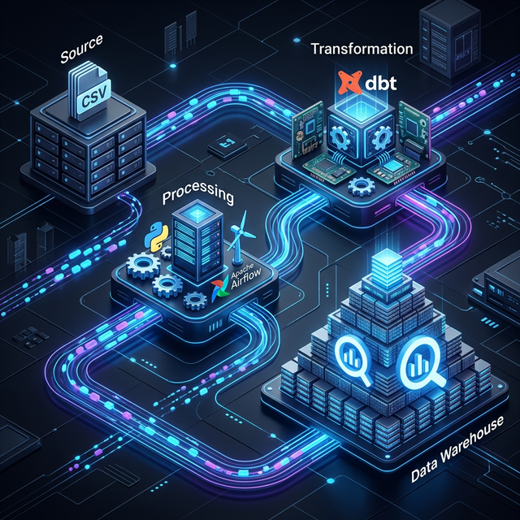
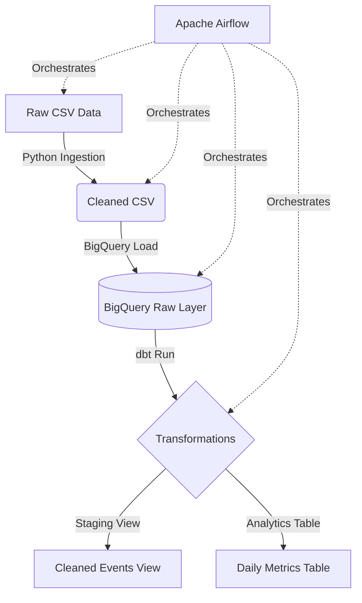
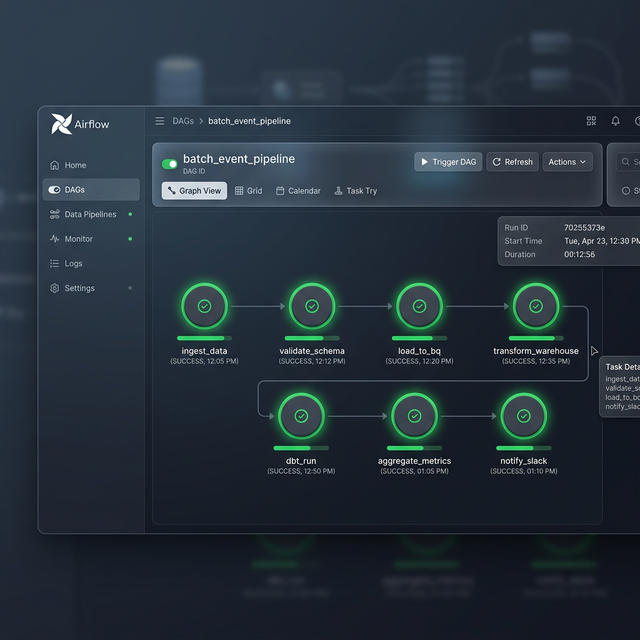

# 🚀 Batch Data Pipeline: Airflow, BigQuery & dbt



## 📋 Table of Contents
- [Project Overview](#-project-overview)
- [Architecture](#-architecture)
- [Tech Stack](#-tech-stack)
- [Data Flow](#-data-flow)
- [Setup Instructions](#-setup-instructions)
- [Project Understanding & Interview Prep](#-project-understanding--interview-prep)

---

## 🌟 Project Overview
This repository contains a **production-style batch data pipeline** designed to ingest, clean, and transform large datasets. By orchestrating **Python**, **Google BigQuery**, and **dbt** with **Apache Airflow**, this project demonstrates a modern ELT (Extract, Load, Transform) workflow that is scalable, idempotent, and highly reliable.

---

## 🏗 Architecture
The following diagram illustrates the high-level architecture of the pipeline:



---

## 🛠 Tech Stack

| Technology | Use Case | Why we use it? |
| :--- | :--- | :--- |
| **Apache Airflow** | Orchestration | Manages task dependencies, retries, and scheduling via DAGs. |
| **Google BigQuery** | Data Warehouse | Serverless, petabyte-scale analytics warehouse with built-in partitioning. |
| **dbt (Data Build Tool)** | Transformation | Modular SQL with version control, testing, and lineage tracking. |
| **Python / Pandas** | Data Cleaning | Flexible row-level processing for handling messy raw source data. |
| **Google Cloud SDK** | Cloud Integration | Provides client libraries (`google-cloud-bigquery`) for programmatic access. |

---

## 📸 Pipeline in Action

*Figure 1: Airflow Dashboard showing a successful execution of the `batch_event_pipeline` DAG.*

---

## 🔄 Data Flow
1. **Extraction**: Python script pulls data from `raw_events.csv`.
2. **Cleaning**: Handles null values, re-formats timestamps, and ensures data integrity.
3. **Loading**: Data is loaded into a **partitioned** BigQuery table (`raw_data.events`).
4. **Transformation**:
   - `stg_events`: Normalizes fields and applies standard business naming conventions (View).
   - `daily_event_counts`: Aggregates activity (DAU, event counts) into analysis-ready tables (Table).

---

## 📂 Project Structure
```text
project/
 ├── dags/                    # Airflow DAG definition
 │    └── batch_pipeline_dag.py
 ├── etl/                     # Python ETL scripts
 │    ├── ingest.py           # Cleans raw CSV data
 │    └── load_to_bq.py       # Loads cleaned data to BigQuery
 ├── dbt_project/             # dbt models & configuration
 │    ├── models/
 │    │    ├── staging/       # stg_events (view)
 │    │    └── analytics/     # daily_event_counts (table)
 │    ├── dbt_project.yml
 │    └── profiles.yml
 ├── data/                    # Sample data & visual assets
 ├── understanding.md         # Deep dive + Interview Prep (Top 15 Q&A)
 ├── .env.example             # Environment variable template
 ├── requirements.txt         # Python dependencies
 └── README.md                # You are here
```

---

## 🚀 Setup Instructions

### 1. Prerequisites
- Python 3.8+
- Google Cloud Project with **BigQuery API** enabled.
- A **Service Account** JSON key with `BigQuery Admin` role.

### 2. Environment Configuration
```bash
cp .env.example .env
# Edit .env with your GCP project ID and key path
```

### 3. Install Dependencies
```bash
pip install -r requirements.txt
```

### 4. Run Locally (Manual)
```bash
# Step 1: Ingest and Clean Data
python etl/ingest.py

# Step 2: Load to BigQuery
python etl/load_to_bq.py

# Step 3: Transform with dbt
cd dbt_project && dbt run --profiles-dir .
```

### 5. Run with Airflow
```bash
# Trigger the DAG from the Airflow UI or CLI
airflow dags trigger batch_event_pipeline
```

---

## 🗄 BigQuery Table Schema

### Table: `raw_data.events` (Partitioned by `timestamp`)
```sql
CREATE TABLE IF NOT EXISTS `your-project.raw_data.events` (
    user_id      INT64,
    event_type   STRING,
    timestamp    TIMESTAMP
)
PARTITION BY DATE(timestamp);
```

---

## 🧠 Project Understanding & Interview Prep
For a detailed explanation of every tool, why they were chosen, and **Top 15 Interview Questions** related to this project, please refer to:
👉 **[understanding.md](./understanding.md)**

---
*Created for portfolio demonstration and interview readiness.*
