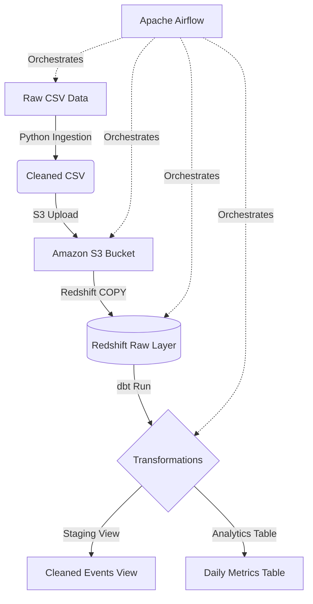

# 🚀 Batch Data Pipeline: Airflow, S3, Redshift & dbt


## 📋 Table of Contents
- [Project Overview](#-project-overview)
- [Architecture](#-architecture)
- [Tech Stack](#-tech-stack)
- [Data Flow](#-data-flow)
- [Setup Instructions](#-setup-instructions)
- [Project Understanding & Interview Prep](#-project-understanding--interview-prep)

---

## 🌟 Project Overview
This repository contains a **production-style batch data pipeline** designed to ingest, clean, and transform large datasets. By orchestrating **Python**, **Amazon S3**, **Amazon Redshift**, and **dbt** with **Apache Airflow**, this project demonstrates a modern ELT (Extract, Load, Transform) workflow that is scalable, idempotent, and highly reliable.

---

## 🏗 Architecture
The following diagram illustrates the high-level architecture of the pipeline:



---

## 🛠 Tech Stack

| Technology | Use Case | Why we use it? |
| :--- | :--- | :--- |
| **Apache Airflow** | Orchestration | Manages task dependencies, retries, and scheduling. |
| **Amazon S3** | Data Lake / Staging | Highly durable storage for raw and cleaned files. |
| **Amazon Redshift** | Data Warehouse | High-performance, petabyte-scale cloud data warehouse. |
| **dbt (Data Build Tool)** | Transformation | Allows SQL modeling with version control and testing. |
| **Python / Pandas** | Data Cleaning | Flexible processing for handling messy raw source data. |

---

## 📸 Pipeline in Action

<!-- Add your own real Airflow screenshot here after running the pipeline -->
<!--  -->

> 💡 **To add a real screenshot:** Run the pipeline locally with Airflow, take a screenshot of the DAG run in the Airflow UI, save it as `data/airflow_dag_screenshot.png`, and uncomment the image line above.

---

## 🔄 Data Flow
1. **Extraction**: Python script pulls data from `raw_events.csv`.
2. **Cleaning**: Handles null values, re-formats timestamps, and ensures data integrity.
3. **Loading**: Data is uploaded to **S3** and then copied into **Redshift** using the `COPY` command.
4. **Transformation**:
   - `stg_events`: Normalizes fields and applies standard business naming conventions.
   - `daily_event_counts`: Aggregates activity into analysis-ready tables.

---

## 📂 Project Structure
```text
project/
 ├── dags/                # Airflow DAG definition
 ├── etl/                 # Python scripts (Cleaning & AWS Loading)
 ├── dbt_project/         # dbt models for Redshift
 ├── data/                # Sample data and design assets
 ├── understanding.md     # Deep dive into "The Why" and Interview Prep
 ├── requirements.txt     # Python dependencies
 └── README.md            # You are here
```

---

## 🚀 Setup Instructions

### 1. Prerequisites
- Python 3.8+
- AWS Account with S3 and Redshift enabled.
- IAM Role with `AmazonS3ReadOnlyAccess` for Redshift.

### 3. Run with Docker (Recommended)
This will start Airflow and all dependencies in containers.

1.  **Initialize Airflow**:
    ```bash
    docker-compose up airflow-init
    ```
2.  **Start the Stack**:
    ```bash
    docker-compose up -d
    ```
3.  **Access Airflow**: Open `http://localhost:8080` (User: `airflow`, Pass: `airflow`).

### 4. Run Locally (Manual)
```bash
# Install dependencies
pip install -r requirements.txt

# Ingest and Clean Data
python etl/ingest.py

# Load to AWS (Set your ENV variables first)
python etl/load_to_aws.py

# Transform with dbt
cd dbt_project && dbt run --profiles-dir .
```

---

## 🧠 Project Understanding & Interview Prep
For a detailed explanation of every tool, why they were chosen, and **Top 15 Interview Questions** related to this project, please refer to:
👉 **[understanding.md](./understanding.md)**

---
*Created for portfolio demonstration and interview readiness.*
